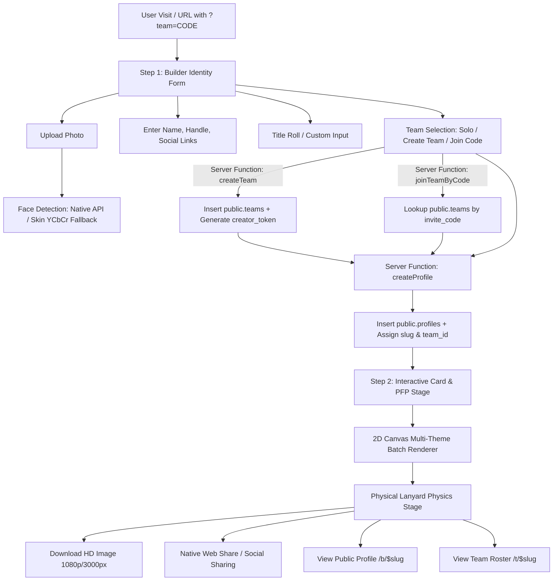

# 🌴 Hacker House Goa 2026 — Builder Identity Forge

> **Create, customize, and share high-resolution Hacker House Goa 2026 Builder ID Cards & PFPs.** Built with real-time 2D Canvas rendering, smart face auto-framing, team crew rosters, dynamic QR codes, and native social sharing.


---

## 📖 Table of Contents

- [Overview](#-overview)
- [Key Features](#-key-features)
- [Application Flow & Architecture](#-application-flow--architecture)
- [Tech Stack](#-tech-stack)
- [Database Schema & Security Model](#-database-schema--security-model)
- [Project Directory Structure](#-project-directory-structure)
- [Getting Started](#-getting-started)
  - [Prerequisites](#prerequisites)
  - [Installation](#installation)
  - [Environment Variables](#environment-variables)
  - [Database Setup & Migrations](#database-setup--migrations)
  - [Running Locally](#running-locally)
- [Available Scripts](#-available-scripts)
- [API & Server Functions](#-api--server-functions)
- [Design System & Animation Physics](#-design-system--animation-physics)
- [Deployment](#-deployment)
- [License & Acknowledgments](#-license--acknowledgments)

---

## 🌟 Overview

**HH Goa 2026 Builder Identity Forge** is an event platform designed for attendees and builders at **Hacker House Goa 2026** (in collaboration with **2:47 PM Studio**). It allows users to:

1. Upload a portrait photograph and automatically detect their face for perfect card composition.
2. Select from 7 custom Goa-inspired visual themes (*Sunset Shack*, *Beach Builders*, *On The Road*, *Hack. Eat. Repeat.*, *Hacker House Hangout*, *Code & Chill*, *We Shipped!*).
3. Toggle between full physical **ID Cards** (complete with an animated fabric lanyard & metallic clasp) and circular **PFPs** (Profile Pictures).
4. Create or join builder **Teams** using secure 8-character invite codes.
5. Export high-definition PNGs (up to 3x resolution render output).
6. Share directly to social media (X/Twitter, LinkedIn, Instagram) or generate public shareable links (`/b/$slug` for builders and `/t/$slug` for team rosters).

---

## ✨ Key Features

### 🎨 1. Real-Time 2D Canvas Engine & 7 Unique Themes
- **Pixel-Perfect Canvas Renderer**: Custom HTML5 2D Canvas rendering engine (`src/lib/render.ts`) capable of exporting crystal-clear 1080p+ PFPs and 3000px+ HD ID Cards.
- **7 Curated Goa Visual Styles**:
  - `classic` (**Sunset Shack**): Golden hour retro vibe.
  - `beach-builders` (**Beach Builders**): Ocean-front crew energy.
  - `goa-ride` (**On The Road**): Scooter & palm roadtrip design.
  - `hack-eat-repeat` (**Hack. Eat. Repeat.**): Midnight hacking aesthetic.
  - `hangout` (**Hacker House Hangout**): House community memories.
  - `code-chill` (**Code & Chill**): Relaxed Goa coding style.
  - `we-shipped` (**We Shipped!**): Celebration of product launches.

### 🎯 2. Smart Face Detection & Auto-Framing
- **Native Browser Detection**: Leverages Chromium's experimental native `FaceDetector` API when available for sub-millisecond face bounding-box detection.
- **Color-Space Fallback Heuristic**: Features a custom algorithm using skin-tone thresholding in YCbCr color space combined with Gaussian center-weighted spatial evaluation to center faces automatically on downscaled images.
- **Manual Precision Controls**: Live Zoom, Horizontal Offset, Vertical Offset, and Face Auto-Crop toggles.

### 👔 3. Interactive Physical Lanyard Simulation
- **SVG & CSS Physics**: Custom SVG lanyard component (`Lanyard.tsx`) featuring woven fabric micro-textures, specular metal clasp highlights, and realistic sway/kick physics (`hh-hang`, `hh-kick`, `hh-lany-sway`).
- **Reduced Motion Support**: Fully accessible with `prefers-reduced-motion` fallbacks.

### 👥 4. Team Roster & Secure Invite Codes
- **Crew Collaboration**: Builders can create a crew or join existing teammates via 8-character uppercase invite codes (`/ ?team=CODE`).
- **Rate-Limited Server Protection**: Server-side IP hashing (`SHA-256`) and attempt logging in `invite_attempts` table to prevent code brute-forcing.
- **Creator Credentials**: Private 24-byte hex token (`creator_token`) issued to team creators for secure code rotation (`regenerateInviteCode`).

### 📱 5. Dynamic Dual QR Code System
- **Builder Profile QR**: Encodes individual profile URL (`/b/$slug?team=CODE`). Scanning opens the builder's profile and prompts the scanner to join their team.
- **Team Roster QR**: Encodes crew URL (`/t/$slug`). Directs scanners to the public team page displaying every teammate's ID card.

### 🎲 6. Builder Title Generator
- **Interactive Wheel Spin**: One-click title generator with smooth 360° SVG spin keyframe animation (`hh-spin-once`).
- **Curated Queue**: Randomizes through tech-forward, fun, and Goa-themed builder titles ("AI Engineer", "Solana Dev", "Shack Hacker", etc.).

### 🚀 7. Social Sharing & SEO Engine
- **Native Web Share API**: Direct file sharing with attached PNG and pre-filled hashtag caption (`#FrameInGoa #HackerHouseGoa`).
- **Platform Integrations**: Dedicated export buttons for X (Twitter), LinkedIn, and Instagram with automatic clipboard caption copying.
- **SEO & Schema.org**: Server-rendered dynamic OpenGraph meta tags, canonical links, and `Person`/`CollectionPage` JSON-LD structured data for indexation.
- **Dynamic Sitemap**: Dynamic XML sitemap generator route (`/sitemap.xml`) listing all public builder profiles and teams.

---

## 🏗 Application Flow & Architecture



---

## 🛠 Tech Stack

| Layer | Technology | Purpose |
| :--- | :--- | :--- |
| **Framework** | [TanStack Start](https://tanstack.com/router/latest/docs/framework/react/start/overview) | SSR framework built on TanStack Router & Nitro |
| **Frontend Library** | [React 19](https://react.dev/) | UI component state management & rendering |
| **Routing** | [TanStack React Router](https://tanstack.com/router) | Type-safe SSR file-based router |
| **Styling** | [Tailwind CSS v4](https://tailwindcss.com/) | Modern utility-first CSS engine with OKLCH color design system |
| **Database & Auth** | [Supabase PostgreSQL](https://supabase.com/) | Database backend with Row Level Security (RLS) & column-level grants |
| **Build & Dev Server**| [Vite 8](https://vitejs.dev/) + [Nitro](https://nitro.unjs.io/) | Fast HMR development server & production bundler |
| **Icons & QR** | [Lucide React](https://lucide.dev/) + `qrcode` | Crisp vector icons & canvas QR code generation |
| **Runtime & Lock** | Node.js / Bun (`bun.lock`) | Package management & environment execution |

---

## 🔒 Database Schema & Security Model

The database is built on Supabase PostgreSQL with strict **Row Level Security (RLS)** policies and column-level permission grants.

```
┌─────────────────────────────────┐       ┌─────────────────────────────────┐
│          public.teams           │       │         public.profiles         │
├─────────────────────────────────┤       ├─────────────────────────────────┤
│ id (UUID, PK)                   │ 1   * │ id (UUID, PK)                   │
│ name (TEXT)                     │───────│ slug (TEXT UNIQUE)              │
│ slug (TEXT UNIQUE)              │       │ name (TEXT)                     │
│ invite_code (TEXT UNIQUE)       │       │ x_handle (TEXT)                 │
│ creator_token (TEXT)            │       │ github (TEXT)                   │
│ created_at (TIMESTAMPTZ)        │       │ linkedin (TEXT)                 │
└─────────────────────────────────┘       │ portfolio (TEXT)                │
                                          │ stack (TEXT)                    │
┌─────────────────────────────────┐       │ builder_title (TEXT)            │
│     public.invite_attempts      │       │ team_id (UUID FK -> teams.id)   │
├─────────────────────────────────┤       │ created_at (TIMESTAMPTZ)        │
│ id (UUID, PK)                   │       └─────────────────────────────────┘
│ ip_hash (TEXT)                  │
│ kind (TEXT: join/create/regen)  │
│ ok (BOOLEAN)                    │
│ created_at (TIMESTAMPTZ)        │
└─────────────────────────────────┘
```

### Security Highlights
1. **Column-Level Grant Isolation**:
   - Anonymous & authenticated clients are explicitly granted access to public team metadata only: `GRANT SELECT (id, name, slug, created_at) ON public.teams TO anon, authenticated;`.
   - `invite_code` and `creator_token` are **never** exposed over public REST API queries.
2. **Server-Only Mutations**:
   - `INSERT`, `UPDATE`, and `DELETE` on `profiles` and `teams` are revoked from client roles. Creation occurs strictly via TanStack Start Server Functions using the `service_role` client (`client.server.ts`).
3. **Internal Rate Limiting**:
   - `invite_attempts` records anonymized IP hashes (`SHA-256`) to cap code verification attempts (Max 8 failures / 30 attempts per 10-minute window).

---

## 📁 Project Directory Structure

```
.
├── .env                           # Environment credentials
├── package.json                   # Project dependencies & scripts
├── vite.config.ts                 # Vite + TanStack Start plugin configuration
├── tsconfig.json                  # TypeScript compiler setup
├── eslint.config.js               # ESLint configuration
├── bunfig.toml / bun.lock         # Bun lockfile
│
├── public/                        # Static public assets
│   └── favicon.ico
│
├── supabase/                      # Supabase database config & SQL migrations
│   ├── config.toml
│   └── migrations/
│       ├── 20260811130931_...sql   # Initial schema (teams & profiles tables + RLS)
│       ├── 20260811141218_...sql   # Add team invite_code column
│       ├── 20260811142423_...sql   # Create invite_attempts rate-limiting table
│       ├── 20260811183628_...sql   # Restrict client table access & enforce server-only writes
│       └── 20260811184028_...sql   # Add creator_token to teams
│
└── src/                           # Application source code
    ├── assets/                    # Theme artwork JSON manifests & logos
    │   ├── theme-1.png.asset.json ... theme-7.png.asset.json
    │   ├── hh-goa-wordmark.png.asset.json
    │   └── studio-247.png.asset.json
    │
    ├── components/                # React UI components
    │   ├── Lanyard.tsx            # SVG Fabric Lanyard with physics & texture
    │   └── ui/                    # Reusable Radix UI & Shadcn primitives
    │
    ├── integrations/              # External service integrations
    │   └── supabase/
    │       ├── client.ts          # Public Supabase client
    │       ├── client.server.ts   # Server-side Service Role client
    │       ├── auth-middleware.ts # Auth token attacher
    │       └── types.ts           # Generated TypeScript database types
    │
    ├── lib/                       # Utility modules & server logic
    │   ├── card-designs.ts        # Theme design metadata
    │   ├── face.ts                # Native & skin YCbCr face detection algorithms
    │   ├── profiles.functions.ts  # TanStack Start profile creation server function
    │   ├── render.ts              # 2D Canvas rendering engine (Card & PFP)
    │   ├── teams.functions.ts     # Server functions for team creation & joining
    │   ├── teams.server.ts        # Server-only crypto helper (IP hashing & codes)
    │   ├── themes.ts              # 7 Theme geometry definitions & slot maps
    │   ├── titles.ts              # Random builder title pool & generator
    │   └── validation.ts          # Input sanitization & field length validation
    │
    ├── routes/                    # File-based TanStack React Router routes
    │   ├── __root.tsx             # Root layout component, HTML head & fonts
    │   ├── index.tsx              # Main identity generator page (Step 1 & Step 2)
    │   ├── b.$slug.tsx            # Public builder ID card profile route (/b/$slug)
    │   ├── t.$slug.tsx            # Public team crew roster route (/t/$slug)
    │   └── sitemap[.]xml.ts       # Dynamic sitemap generator endpoint
    │
    ├── router.tsx                 # TanStack Router instance creation
    ├── server.ts                  # SSR entrypoint & catastrophic error wrapper
    ├── start.ts                   # TanStack Start initialization
    └── styles.css                 # Tailwind CSS v4 setup, OKLCH tokens & keyframes
```

---

## 🚀 Getting Started

### Prerequisites

- **Node.js**: v18.0.0 or higher (or [Bun](https://bun.sh/) v1.0+)
- **npm** / **yarn** / **pnpm** / **bun**
- **Supabase Account** (or local Supabase CLI instance)

### Installation

1. **Clone the repository**:
   ```bash
   git clone https://github.com/your-username/hhgoa-identity-forge.git
   cd hhgoa-identity-forge
   ```

2. **Install dependencies**:
   ```bash
   npm install
   # or
   bun install
   ```

### Environment Variables

Create a `.env` file in the root directory (or copy from `.env.example` if available):

```env
# Public Supabase API Credentials
VITE_SUPABASE_URL="https://your-project-id.supabase.co"
VITE_SUPABASE_PUBLISHABLE_KEY="your-publishable-key"

# Server-Side Supabase Credentials (Used by TanStack Start server functions)
SUPABASE_URL="https://your-project-id.supabase.co"
SUPABASE_PUBLISHABLE_KEY="your-publishable-key"
SUPABASE_SERVICE_ROLE_KEY="your-supabase-service-role-key"
```

> [!IMPORTANT]
> Ensure `SUPABASE_SERVICE_ROLE_KEY` is provided in production server environments to allow secure server functions to write profiles and handle invite code checks bypassing restricted client RLS.

### Database Setup & Migrations

If configuring a new Supabase project:

1. **Link Supabase project**:
   ```bash
   npx supabase link --project-ref your-project-id
   ```

2. **Push database migrations**:
   ```bash
   npx supabase db push
   ```

Alternatively, run the SQL scripts in `supabase/migrations/` in chronological order using the Supabase SQL Editor.

### Running Locally

Start the Vite development server with HMR:

```bash
npm run dev
```

Open your browser at `http://localhost:5173` (or the port indicated in terminal).

---

## 📜 Available Scripts

| Command | Description |
| :--- | :--- |
| `npm run dev` | Launches the Vite + TanStack Start development server |
| `npm run build` | Builds the production bundle using Nitro |
| `npm run build:dev` | Builds the bundle in development mode |
| `npm run preview` | Previews the production build locally |
| `npm run lint` | Runs ESLint to check for code quality and syntax errors |
| `npm run format` | Formats the codebase using Prettier |

---

## ⚡ API & Server Functions

TanStack Start server functions (`createServerFn`) execute safely on the server side:

### 1. `createProfile` (`src/lib/profiles.functions.ts`)
- **Input**: `{ name, xHandle?, github?, linkedin?, builderTitle?, inviteCode? }`
- **Action**: Validates inputs, resolves team ID from `inviteCode` (if provided), generates a unique builder slug (`slugify(name)-rand`), and writes the profile record using `supabaseAdmin`.
- **Response**: `{ slug }`

### 2. `createTeam` (`src/lib/teams.functions.ts`)
- **Input**: `{ name }`
- **Action**: Checks rate limits, generates a unique 8-character uppercase invite code and 24-byte hex `creator_token`, and inserts the team into `public.teams`.
- **Response**: `{ id, name, slug, code, creatorToken }`

### 3. `joinTeamByCode` (`src/lib/teams.functions.ts`)
- **Input**: `{ code }`
- **Action**: Normalizes code format, checks IP attempt rate limits, queries `public.teams` via `supabaseAdmin`.
- **Response**: `{ id, name, slug, code }`

### 4. `regenerateInviteCode` (`src/lib/teams.functions.ts`)
- **Input**: `{ teamId, creatorToken }`
- **Action**: Verifies `creatorToken` ownership and updates `invite_code` with a fresh 8-character string.
- **Response**: `{ id, name, slug, code }`

---

## 🎨 Design System & Animation Physics

The design system is implemented in `src/styles.css` using **Tailwind CSS v4** and OKLCH color space for vibrant contrast on all display types:

- **Primary Accent Color**: `oklch(0.9 0.19 100)` (Goa Sunshine Yellow `#F5B71B`)
- **Background Color**: `oklch(0.24 0.055 155)` (Deep Jungle Green `#071C12`)
- **Accent Highlight**: `oklch(0.65 0.24 5)` (Vibrant Sunset Pink `#FF2E88`)

### Custom Animations (`styles.css`)
- `hh-swing`: Gentle 5.5-second pendulum sway for hanging ID cards.
- `hh-kick`: Smooth 1.1-second impulse animation when changing card themes.
- `hh-card-in-right` / `hh-card-in-left`: 3D perspective rotation transitions on carousel navigation.
- `hh-lany-sway` / `hh-lany-kick`: Synchronized lanyard strap movement.

---

## 🌐 Deployment

This project builds into a standalone SSR server engine powered by **Nitro**.

### Cloudflare Pages / Vercel / Netlify
1. Connect your repository to your deployment provider.
2. Set the build command: `npm run build`
3. Set environment variables (`SUPABASE_URL`, `SUPABASE_PUBLISHABLE_KEY`, `SUPABASE_SERVICE_ROLE_KEY`, `VITE_SUPABASE_URL`, `VITE_SUPABASE_PUBLISHABLE_KEY`).
4. Set build output directory (Nitro output directory: `.output/public` or standard server entry depending on provider adapter).

---

## 📄 License & Acknowledgments

- **Built for**: [Hacker House Goa 2026](https://hackerhousegoa.com)
- **Collaborator**: 2:47 PM Studio
- **Platform Provider**: [Lovable](https://lovable.dev)
- **License**: MIT License. Feel free to remix and adapt for your own hacker house or conference events!

---

<p center="true" align="center">
Made with 💛 for the global hacker community in Goa 🌴
</p>
# HHGoa2026_ID_Card

